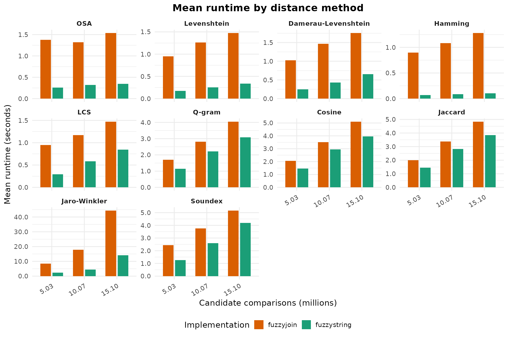
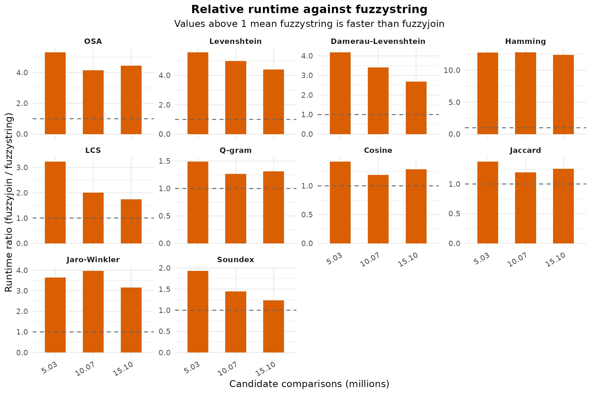

# Benchmarking fuzzystring against fuzzyjoin

``` r

library(dplyr)
#> 
#> Attaching package: 'dplyr'
#> The following objects are masked from 'package:stats':
#> 
#>     filter, lag
#> The following objects are masked from 'package:base':
#> 
#>     intersect, setdiff, setequal, union
library(tidyr)
library(ggplot2)

find_benchmark_csv <- function() {
  candidates <- c(
    file.path("inst", "extdata", "rbase_string_benchmark.csv"),
    file.path("..", "inst", "extdata", "rbase_string_benchmark.csv"),
    system.file("extdata", "rbase_string_benchmark.csv", package = "fuzzystring")
  )

  hit <- candidates[file.exists(candidates)][1]

  if (is.na(hit)) {
    stop(
      "Could not find the precomputed benchmark CSV. Expected it in ",
      paste(candidates, collapse = " or "),
      call. = FALSE
    )
  }

  hit
}

results_raw <- utils::read.csv(find_benchmark_csv(), stringsAsFactors = FALSE)

method_levels <- c(
  "osa", "lv", "dl", "hamming", "lcs",
  "qgram", "cosine", "jaccard", "jw", "soundex"
)

method_labels <- c(
  osa = "OSA",
  lv = "Levenshtein",
  dl = "Damerau-Levenshtein",
  hamming = "Hamming",
  lcs = "LCS",
  qgram = "Q-gram",
  cosine = "Cosine",
  jaccard = "Jaccard",
  jw = "Jaro-Winkler",
  soundex = "Soundex"
)

comparison_levels <- sprintf(
  "%.2f",
  sort(unique(results_raw$n_comps / 1e6))
)

summary_raw <- results_raw %>%
  group_by(expr, method, n_comps) %>%
  summarise(mean_time_ns = mean(time), .groups = "drop") %>%
  mutate(mean_time_ms = mean_time_ns / 1e6)

wide_summary <- summary_raw %>%
  select(expr, method, n_comps, mean_time_ms) %>%
  pivot_wider(names_from = expr, values_from = mean_time_ms) %>%
  mutate(
    runtime_ratio = fuzzyjoin / fuzzystring,
    method_label = factor(
      recode(method, !!!method_labels),
      levels = unname(method_labels[method_levels])
    ),
    comparisons_millions = n_comps / 1e6,
    comparisons_label = factor(
      sprintf("%.2f", comparisons_millions),
      levels = comparison_levels
    )
  ) %>%
  arrange(method_label, n_comps)

absolute_plot_data <- summary_raw %>%
  mutate(
    time_seconds = mean_time_ms / 1000,
    method_label = factor(
      recode(method, !!!method_labels),
      levels = unname(method_labels[method_levels])
    ),
    comparisons_label = factor(
      sprintf("%.2f", n_comps / 1e6),
      levels = comparison_levels
    ),
    implementation = factor(expr, levels = c("fuzzyjoin", "fuzzystring"))
  )

method_ranking <- wide_summary %>%
  group_by(method_label) %>%
  summarise(avg_runtime_ratio = mean(runtime_ratio), .groups = "drop") %>%
  arrange(desc(avg_runtime_ratio))

summary_table <- wide_summary %>%
  transmute(
    Method = as.character(method_label),
    `Candidate comparisons (M)` = sprintf("%.2f", comparisons_millions),
    `Mean time: fuzzyjoin (ms)` = round(fuzzyjoin, 2),
    `Mean time: fuzzystring (ms)` = round(fuzzystring, 2),
    `Runtime ratio (fuzzyjoin / fuzzystring)` = round(runtime_ratio, 2)
  )

ranking_table <- method_ranking %>%
  transmute(
    Method = as.character(method_label),
    `Average runtime ratio` = round(avg_runtime_ratio, 2)
  )

overall_ratio <- mean(wide_summary$runtime_ratio)
```

## Overview

This vignette documents the benchmark used to compare **fuzzyjoin** with
the
[`fuzzystring_join()`](https://paulesantos.github.io/fuzzystring/reference/fuzzystring_join.md)
reimplementation in **fuzzystring**. The benchmark code is shown for
reproducibility, but it is **not executed** when this vignette is built.
Instead, the analysis below reads the precomputed CSV snapshot bundled
in `inst/extdata/rbase_string_benchmark.csv`.

The benchmark covers 10 distance methods, 3 sample sizes (`250`, `500`,
and `750`), and 10 repetitions per implementation. Across 30 method-size
combinations, **fuzzystring** is faster in every case. The mean runtime
ratio is 3.70x, meaning that, on average, `fuzzyjoin` takes almost four
times as long as the reimplemented `fuzzystring` path on this benchmark
snapshot.

## Benchmark Script

The script below is the benchmark used to generate the CSV analyzed in
this document. It is displayed as reference only.

``` r

library(microbenchmark)
library(fuzzyjoin)
library(fuzzystring)
library(qdapDictionaries)
library(tibble)

samp_sizes <- c(250, 500, 750)
seed <- 2016

params <- list(
  list(method = "osa",     mode = "inner", max_dist = 1,   q = 0),
  list(method = "lv",      mode = "inner", max_dist = 1,   q = 0),
  list(method = "dl",      mode = "inner", max_dist = 1,   q = 0),
  list(method = "hamming", mode = "inner", max_dist = 1,   q = 0),
  list(method = "lcs",     mode = "inner", max_dist = 1,   q = 0),
  list(method = "qgram",   mode = "inner", max_dist = 2,   q = 2),
  list(method = "cosine",  mode = "inner", max_dist = 0.5, q = 2),
  list(method = "jaccard", mode = "inner", max_dist = 0.5, q = 2),
  list(method = "jw",      mode = "inner", max_dist = 0.5, q = 0),
  list(method = "soundex", mode = "inner", max_dist = 0.5, q = 0)
)

args <- commandArgs(trailingOnly = TRUE)
if (length(args) > 0) {
  params <- Filter(function(p) p$method %in% args, params)
}

data(misspellings)
words <- as.data.frame(DICTIONARY)

results <- data.frame()

for (p in params) {
  for (nsamp in samp_sizes) {
    cat(sprintf("Running %s with %d samples\n", p$method, nsamp))

    set.seed(seed)
    sub_misspellings <- misspellings[sample(seq_len(nrow(misspellings)), nsamp), ]

    bench <- microbenchmark(
      fuzzyjoin = {
        fuzzy_res <- stringdist_join(
          sub_misspellings, words,
          by         = c(misspelling = "word"),
          method     = p$method,
          mode       = p$mode,
          max_dist   = p$max_dist,
          q          = p$q
        )
      },
      fuzzystring = {
        fuzzystring_res <- fuzzystring_join(
          sub_misspellings, words,
          by       = c(misspelling = "word"),
          method   = p$method,
          mode     = p$mode,
          max_dist = p$max_dist,
          q        = p$q
        )
      },
      times = 10
    )

    # Verify that both implementations return the same result.
    fuzzy_res <- stringdist_join(
      sub_misspellings, words,
      by       = c(misspelling = "word"),
      method   = p$method,
      mode     = p$mode,
      max_dist = p$max_dist,
      q        = p$q
    )

    fuzzystring_res <- fuzzystring_join(
      sub_misspellings, words,
      by       = c(misspelling = "word"),
      method   = p$method,
      mode     = p$mode,
      max_dist = p$max_dist,
      q        = p$q
    )

    if (!isTRUE(all.equal(fuzzy_res, fuzzystring_res)) && p$method != "soundex") {
      message("Mismatch detected: fuzzyjoin vs fuzzystring for method: ", p$method)
    }

    df <- as.data.frame(bench)
    df$method <- p$method
    df$n_comps <- nrow(sub_misspellings) * nrow(words)
    df$os <- unname(Sys.info()["sysname"])

    results <- rbind(results, df)
  }
}
```

## Results

The benchmark spans 10 string distance methods and 3 sample sizes,
producing 30 aggregated method-size combinations. The table below
reports mean runtime in milliseconds and the relative runtime ratio used
throughout the figures.

| Method | Candidate comparisons (M) | Mean time: fuzzyjoin (ms) | Mean time: fuzzystring (ms) | Runtime ratio (fuzzyjoin / fuzzystring) |
|:---|---:|---:|---:|---:|
| OSA | 5.03 | 1379.66 | 260.12 | 5.30 |
| OSA | 10.07 | 1321.82 | 319.37 | 4.14 |
| OSA | 15.10 | 1537.76 | 346.41 | 4.44 |
| Levenshtein | 5.03 | 951.85 | 171.38 | 5.55 |
| Levenshtein | 10.07 | 1262.07 | 253.99 | 4.97 |
| Levenshtein | 15.10 | 1475.74 | 336.28 | 4.39 |
| Damerau-Levenshtein | 5.03 | 1026.49 | 246.08 | 4.17 |
| Damerau-Levenshtein | 10.07 | 1468.94 | 431.47 | 3.40 |
| Damerau-Levenshtein | 15.10 | 1755.88 | 652.79 | 2.69 |
| Hamming | 5.03 | 899.57 | 70.56 | 12.75 |
| Hamming | 10.07 | 1082.91 | 84.86 | 12.76 |
| Hamming | 15.10 | 1281.25 | 103.52 | 12.38 |
| LCS | 5.03 | 946.51 | 293.02 | 3.23 |
| LCS | 10.07 | 1171.63 | 585.67 | 2.00 |
| LCS | 15.10 | 1469.37 | 843.38 | 1.74 |
| Q-gram | 5.03 | 1701.23 | 1142.17 | 1.49 |
| Q-gram | 10.07 | 2811.54 | 2220.70 | 1.27 |
| Q-gram | 15.10 | 4040.81 | 3076.60 | 1.31 |
| Cosine | 5.03 | 2065.86 | 1453.69 | 1.42 |
| Cosine | 10.07 | 3506.38 | 2946.15 | 1.19 |
| Cosine | 15.10 | 5097.47 | 3956.76 | 1.29 |
| Jaccard | 5.03 | 1993.22 | 1447.84 | 1.38 |
| Jaccard | 10.07 | 3378.11 | 2822.45 | 1.20 |
| Jaccard | 15.10 | 4829.91 | 3849.77 | 1.25 |
| Jaro-Winkler | 5.03 | 8522.48 | 2338.06 | 3.65 |
| Jaro-Winkler | 10.07 | 17863.57 | 4505.01 | 3.97 |
| Jaro-Winkler | 15.10 | 44403.12 | 14057.21 | 3.16 |
| Soundex | 5.03 | 2439.60 | 1262.86 | 1.93 |
| Soundex | 10.07 | 3757.79 | 2604.16 | 1.44 |
| Soundex | 15.10 | 5168.49 | 4187.53 | 1.23 |

The ranking below summarizes the average speedup by method. Larger
values mean that **fuzzystring** is faster by a wider margin.

| Method              | Average runtime ratio |
|:--------------------|----------------------:|
| Hamming             |                 12.63 |
| Levenshtein         |                  4.97 |
| OSA                 |                  4.63 |
| Jaro-Winkler        |                  3.59 |
| Damerau-Levenshtein |                  3.42 |
| LCS                 |                  2.32 |
| Soundex             |                  1.54 |
| Q-gram              |                  1.36 |
| Cosine              |                  1.30 |
| Jaccard             |                  1.28 |

### Absolute Runtime

``` r

ggplot(
  absolute_plot_data,
  aes(x = comparisons_label, y = time_seconds, fill = implementation)
) +
  geom_col(position = position_dodge(width = 0.75), width = 0.65) +
  facet_wrap(~ method_label, scales = "free_y") +
  labs(
    title = "Mean runtime by distance method",
    x = "Candidate comparisons (millions)",
    y = "Mean runtime (seconds)",
    fill = "Implementation"
  ) +
  scale_fill_manual(
    values = c("fuzzyjoin" = "#D95F02", "fuzzystring" = "#1B9E77"),
    labels = c("fuzzyjoin", "fuzzystring")
  ) +
  scale_y_continuous(labels = function(x) sprintf("%.1f", x)) +
  theme_minimal(base_size = 14) +
  theme(
    strip.text = element_text(face = "bold"),
    legend.position = "bottom",
    plot.title = element_text(face = "bold", hjust = 0.5),
    plot.subtitle = element_text(hjust = 0.5),
    axis.text.x = element_text(angle = 30, hjust = 1)
  )
```



### Relative Runtime

Values above 1 indicate that **fuzzystring** is faster than
**fuzzyjoin** for the same method and workload size.

``` r

ggplot(
  wide_summary,
  aes(x = comparisons_label, y = runtime_ratio)
) +
  geom_col(fill = "#D95F02", width = 0.55) +
  geom_hline(yintercept = 1, linetype = "dashed", color = "gray40") +
  facet_wrap(~ method_label, scales = "free_y") +
  labs(
    title = "Relative runtime against fuzzystring",
    subtitle = "Values above 1 mean fuzzystring is faster than fuzzyjoin",
    x = "Candidate comparisons (millions)",
    y = "Runtime ratio (fuzzyjoin / fuzzystring)"
  ) +
  scale_y_continuous(labels = function(x) sprintf("%.1f", x)) +
  theme_minimal(base_size = 14) +
  theme(
    strip.text = element_text(face = "bold"),
    legend.position = "none",
    plot.title = element_text(face = "bold", hjust = 0.5),
    plot.subtitle = element_text(hjust = 0.5),
    axis.text.x = element_text(angle = 30, hjust = 1)
  )
```



## Interpretation

This benchmark snapshot supports the same conclusion across all methods
tested: the **fuzzystring** reimplementation is consistently faster than
**fuzzyjoin** for the workloads covered here.

The largest average gains appear in Hamming, Levenshtein, OSA, and
Damerau-Levenshtein, while cosine, q-gram, jaccard, and soundex still
show a clear but smaller improvement. In other words, the reimplemented
path does not only match `fuzzyjoin` functionally; it also improves
runtime across every benchmarked method-size combination in this
snapshot.
